# Pflichtenheft - Online Casino

## Inhaltsverzeichnis

- [1. Ausgangslage](#1-ausgangslage)
  - [1.1. Ist-Situation](#11-ist-situation)
  - [1.2. Verbesserungspotenziale](#12-verbesserungspotenziale)
- [2. Zielsetzung](#2-zielsetzung)
- [3. Funktionale Anforderungen](#3-funktionale-anforderungen)
  - [3.1 Use Case A: Hauptmenü](#31-use-case-a-hauptmenü)
  - [3.2 Use Case B: Spielen von Blackjack](#32-use-case-b-spielen-von-blackjack)
  - [3.3 Use Case C: Spielen von Poker](#33-use-case-c-spielen-von-poker)
  - [3.4 Use Case D: Spielen von Roulette](#34-use-case-d-spielen-von-roulette)
  - [3.5 Use Case E: Spielen von Slot Machine](#35-use-case-e-spielen-von-slot-machine)
  - [3.6 Use Case F: Social Features](#36-use-case-f-social-features)
- [4. Nicht-funktionale Anforderungen](#4-nicht-funktionale-anforderungen)
- [5. Mengengerüst](#5-mengengerüst)
- [6. Systemarchitektur](#6-systemarchitektur)
  - [6.1 Deployment-Diagramm](#61-deployment-diagramm)
  - [6.2 Datenmodell](#62-datenmodell)
- [7. Chancen und Risiken](#7-chancen-und-risiken)
- [8. Projektplanung](#8-projektplanung)

## 1. Ausgangslage

### 1.1. Ist-Situation

- HTL Leonding 3. Klasse Syp-Projekt
- Entwicklung eines Online Casinos als Software-Projekt
- Mit Glück als Logik auseinander setzen
- Weil Glücksspiel ein spannendes Thema für uns ist

### 1.2. Verbesserungspotenziale

- Es gibt physische Kasinos, welche allerdings zahlreiche Schwächen aufweisen.
- Gegenüber einem klassischen Kasino "24/7 Verfügbarkeit" 
- Von überall aus
- Computer erledigen die Arbeit, Automation

## 2. Zielsetzung

- Entwicklung eines benutzerfreundlichen Online-Casinos mit einer modernen und ansprechenden Benutzeroberfläche
- Implementierung verschiedener Casinospielen, darunter Slots, Poker, Roulette und Blackjack
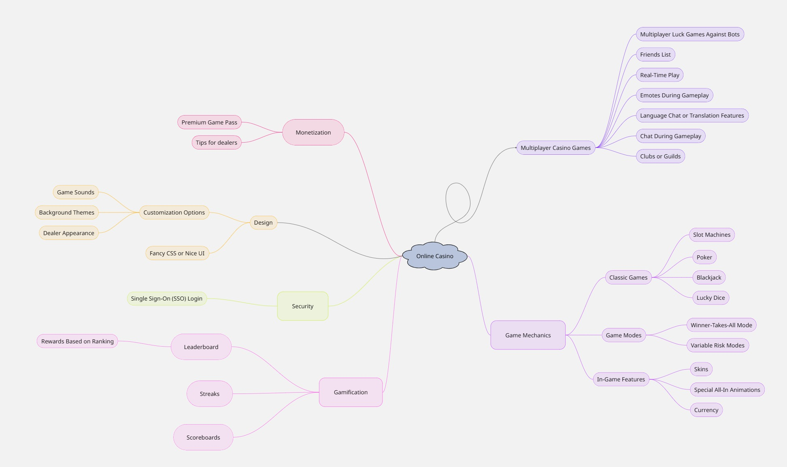

## 3. Funktionale Anforderungen

Die Zielsetzung ist die Entwicklung eines benutzerfreundlichen Online-Casinos mit moderner Benutzeroberfläche. Es sollen verschiedene Spiele implementiert werden: Slots, Poker, Roulette und Blackjack. Das System soll Casino Chips als Währung haben, neue User starten mit 1000 Chips, der stand verändert sich durch gewinnen oder verlieren und um sicherzustellen das der User nicht 0 Chips hat und dann nie wieder spielen kann, werden tägliche Belohnungen eingeführt.
Auserdem brauchen wir eine faire Zufallslogik.

Ziele umfassen: Hohe Verfügbarkeit, Automatisierung der Spiele, Sammeln von Projekterfahrungen und potenziell Monetarisierung. Die Umsetzung erfolgt in Meilensteinen: Grundfunktionen bis Ostern, Erweiterungen bis Mai, Fertigstellung bis Juni.

### 3.1 Use Case A: Hauptmenü
**Akteur:** Eingeloggter Spieler

**Vorbedingung:** Der Benutzer ist eingeloggt und hat Chips auf dem Konto.

**Beschreibung:**
1. Der Benutzer öffnet die Anwendung nach dem Login
2. Das System zeigt das Hauptmenü (Dashboard) an
3. Der Benutzer sieht folgende zentrale Elemente:
    1. Aktuelles Chips & Bonusinformationen (oben prominent)
    2. Schnellzugriffe / Kategorien
    3. Empfohlene / beliebte Spiele
    4. Kontostand(Chips) und Chat
    
4. Der Benutzer kann per Klick/Tap in einen Spielbereich

**Nachbedingung:** Jegliche Aktionen sind verarbeitet, Chips aktualisiert.

**Ausnahmen:** Keine Internetverbindung -> Offline-Hinweis, -> Loadingscreen

Mockup des Hauptmenüs

**Figma-Designs:**
- **Hauptmenü / Home:**
  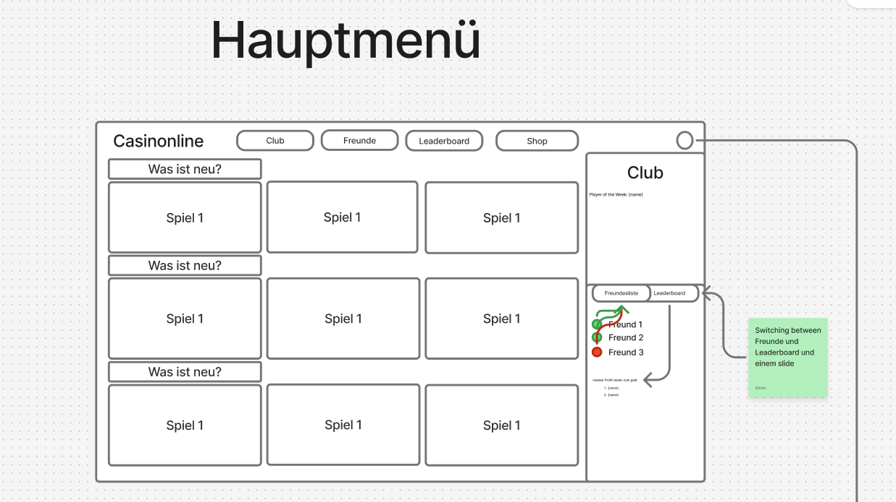
- **Übersicht (Overview):**
  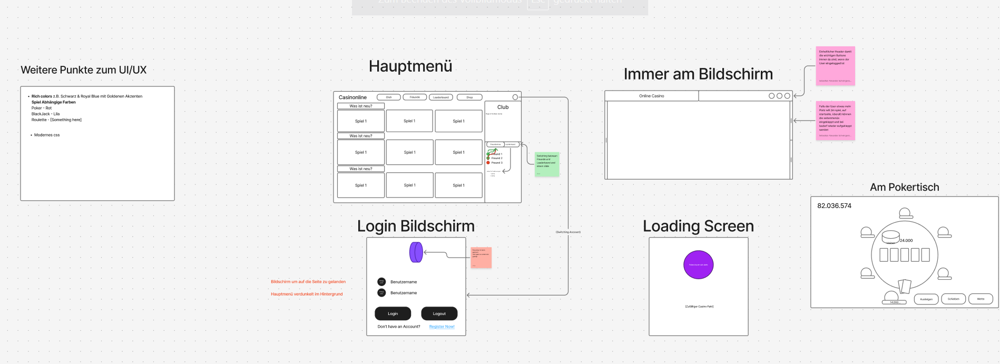
- **Login-Bildschirm:**
  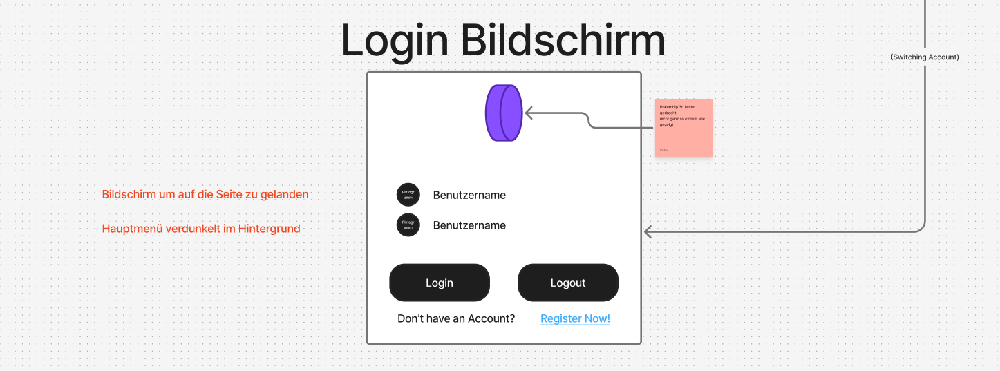
- **Ladebildschirm (Loading Screen):**
  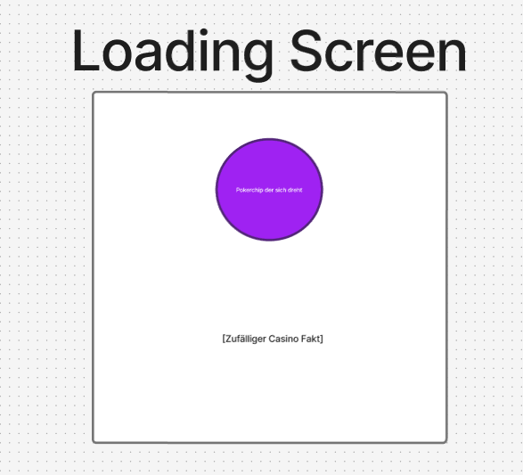
- **Overlay / Dialog:**
  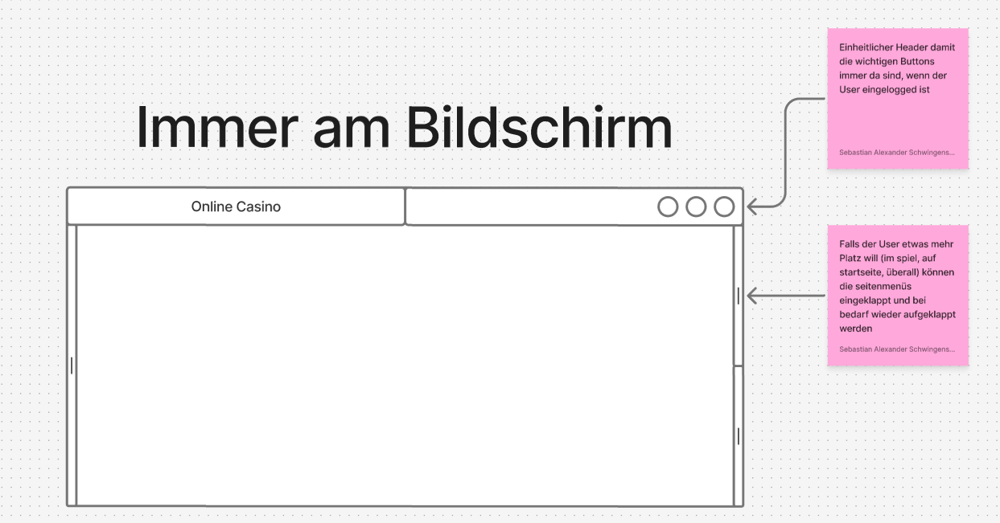

### 3.2 Use Case B: Spielen von Blackjack
**Akteur:** Eingeloggter Spieler

**Vorbedingung:** Der Benutzer hat Chips und wählt Blackjack.

**Beschreibung:**
1. Der Benutzer öffnet den virtuellen Blackjacktisch
2. Er platziert Einsätze.
3. Das System simuliert das Spiel (Karten austeilen, evtl. Spielzüge) mit Zufallsalgorithmen.
4. Runden werden ausgewertet, Gewinne/Verluste berechnet.
5. Der Benutzer kann aus der Runde noch eine Karte bekommen, bleiben, verdoppeln und teilen.
**Nachbedingung:** Spielstand aktualisiert, Chips angepasst.

**Ausnahmen:** Verbindungsprobleme führen zu Pausen, Unzureichendes Chips verhindert den Start.

Mockup des Blackjacktisch
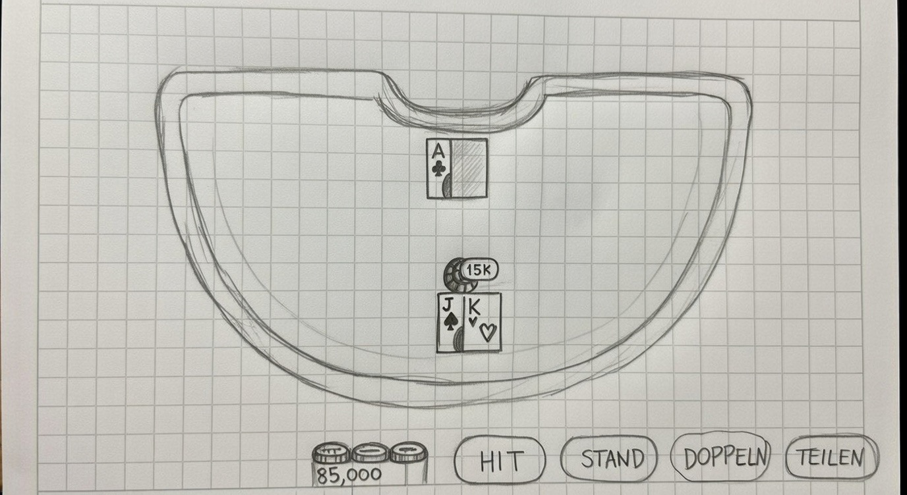

### 3.3 Use Case C: Spielen von Poker
**Akteur:** Eingeloggter Spieler

**Vorbedingung:** Der Benutzer hat Chips und wählt Poker.

**Beschreibung:**
1. Der Benutzer öffnet den virtuellen Pokertisch
2. Er platziert Einsätze.
3. Das System simuliert das Spiel (Karten austeilen) mit Zufallsalgorithmen.
4. Runden werden ausgewertet, Gewinne/Verluste berechnet.
5. Der Benutzer kann aus der Runde aussteigen, er kann mitgehen, oder den Einsatz erhöhen.

**Nachbedingung:** Spielstand aktualisiert, Chips angepasst.

**Ausnahmen:** Verbindungsprobleme führen zu Pausen, Unzureichendes Chips verhindert den Start.

Mockup des Pokertisch

**Figma-Design:**
- **Pokertisch:**
  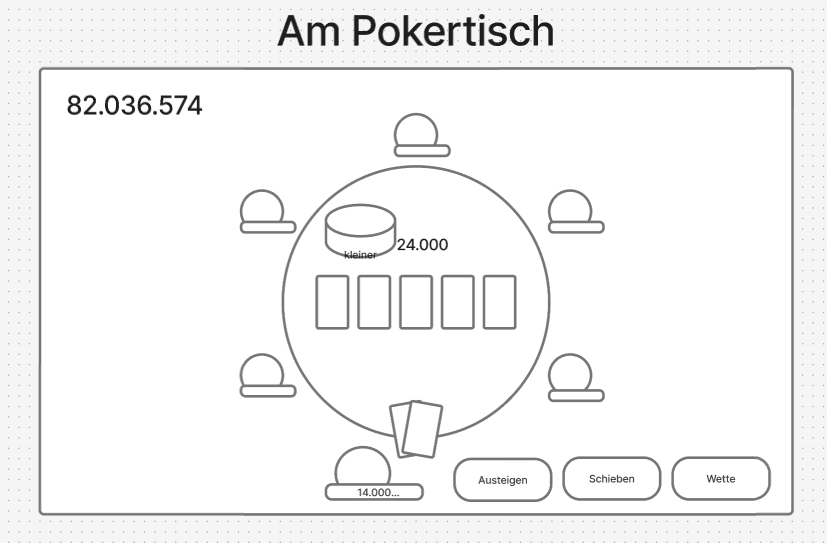

### 3.4 Use Case D: Spielen von Roulette
**Akteur:** Eingeloggter Spieler

**Vorbedingung:** Der Benutzer hat Chips und wählt Roulette.

**Beschreibung:**
1. Der Benutzer öffnet den virtuellen Roulettetisch.
2. Er platziert Einsätze auf dem Tableau (z.B. auf Zahlen, Farben, Dutzende).
3. Das System startet die Kugel im Kessel und simuliert die Drehung mit Zufallsalgorithmen.
4. Die Kugel landet auf einer Zahl.
5. Das System wertet die Runde aus, berechnet Gewinne/Verluste und passt den Chip-Kontostand an.

**Nachbedingung:** Spielstand aktualisiert, Chips angepasst.

**Ausnahmen:** Verbindungsprobleme führen zu Pausen; unzureichende Chips verhindern den Start/Einsatz.

### 3.5 Use Case E: Spielen von Slot Machine
**Akteur:** Eingeloggter Spieler

**Vorbedingung:** Der Benutzer hat Chips und wählt eine Slot Machine.

**Beschreibung:**
1. Der Benutzer öffnet die Slot Machine.
2. Er wählt seinen Einsatz pro Drehung.
3. Der Benutzer startet die Drehung per Klick/Tap.
4. Das System simuliert die Drehung der Walzen mit Zufallsalgorithmen.
5. Die Walzen halten an und zeigen eine Symbolkombination.
6. Das System wertet Gewinnlinien aus und berechnet Gewinne/Verluste.

**Nachbedingung:** Spielstand aktualisiert, Chips angepasst.

**Ausnahmen:** Verbindungsprobleme führen zu Pausen; unzureichende Chips verhindern den Start/Drehung.

### 3.6 Use Case F: Social Features
**Akteur:** Eingeloggter Spieler

**Vorbedingung:** Der Benutzer ist eingeloggt.

**Beschreibung:**
1. Der Benutzer klickt auf das Social-/Chat-Symbol in der Navigation.
2. Die Freundesliste wird geladen und angezeigt.
3. Der Benutzer kann die Liste absteigend oder aufsteigend sortieren nach:
   - Chips
   - Freundschaftsdauer
   - Aktuelle Streak-Länge
   - Name
4. Eingehende Freundschaftsanfragen:
   - Annehmen -> Freund wird hinzugefügt
   - Ablehnen
5. Chatten mit einem Freund:
   - Wird ein Freund ausgewählt, ist auf der Seite der Chatverlauf dessen offen
   - Nachrichten können gesendet werden
   - Empfangene Nachrichten werden angezeigt

**Nachbedingung:**
- Freundesliste ist sichtbar + sortiert
- Gesendete/angenommene Anfragen sind gespeichert
- Chat mit Freunden ist offen bzw. aktualisiert

**Wichtige Ausnahmen:**
- Freundesliste leer -> Hinweis + Button „Freunde finden / einladen“

Mockup der Social-Features
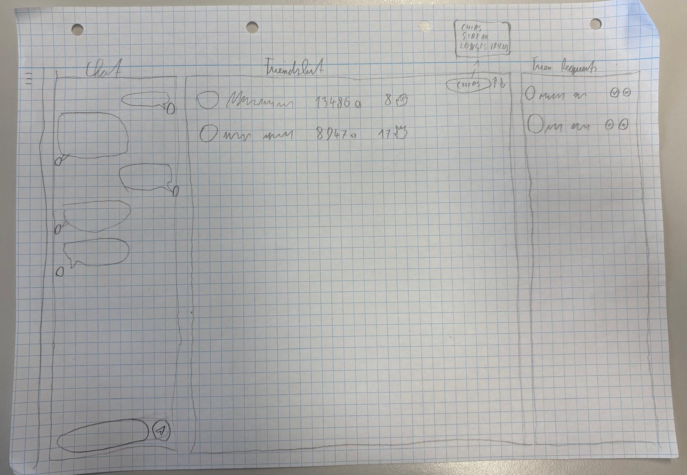

## 4. Nicht-funktionale Anforderungen

| Bereich | Anforderung | Priorität |
| --- | --- | --- |
| **Benutzerfreundlichkeit** | Die Benutzeroberfläche muss intuitiv und selbsterklärend sein, orientiert an den erstellten Mockups. | Hoch |
| **Performance** | - Seitenladezeit (Initial): < 2 Sekunden   - Antwortzeit für Spielinteraktionen (z.B. Karte ziehen): < 200 ms | Hoch |
| **Sicherheit** | - Passwort-Speicherung muss mittels Hashing und Salting (z.B. bcrypt) erfolgen.   - Sämtliche spielrelevante Logik wird serverseitig validiert, um Cheating zu verhindern.   - Schutz vor gängigen Web-Angriffen (OWASP Top 10) wie XSS und SQL-Injection. | Sehr Hoch |
| **Zuverlässigkeit** | - Das System soll eine Verfügbarkeit von 99,5 % aufweisen.   - Bei Verbindungsabbrüchen des Clients soll der Spielzustand serverseitig erhalten bleiben, um Datenverlust zu minimieren. | Hoch |
| **Wartbarkeit** | Der Code muss modular aufgebaut, gut dokumentiert und nach etablierten Coding Conventions des gewählten Technologiestacks geschrieben werden. | Mittel |
| **Fairness** | Die Zufallsgenerierung für Karten und Spielergebnisse muss einen statistisch validen und nicht vorhersagbaren Algorithmus (z.B. CSPRNG) verwenden. | Sehr Hoch |

## 5. Mengengerüst

## 6. Systemarchitektur

### 6.1 Deployment-Diagramm
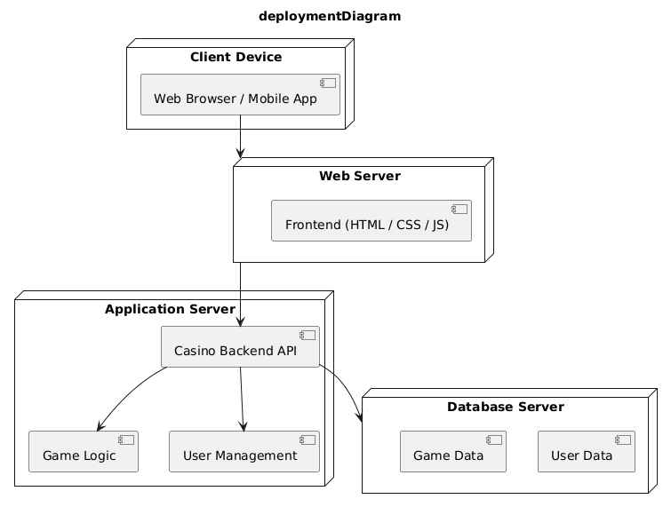

### 6.2 Datenmodell
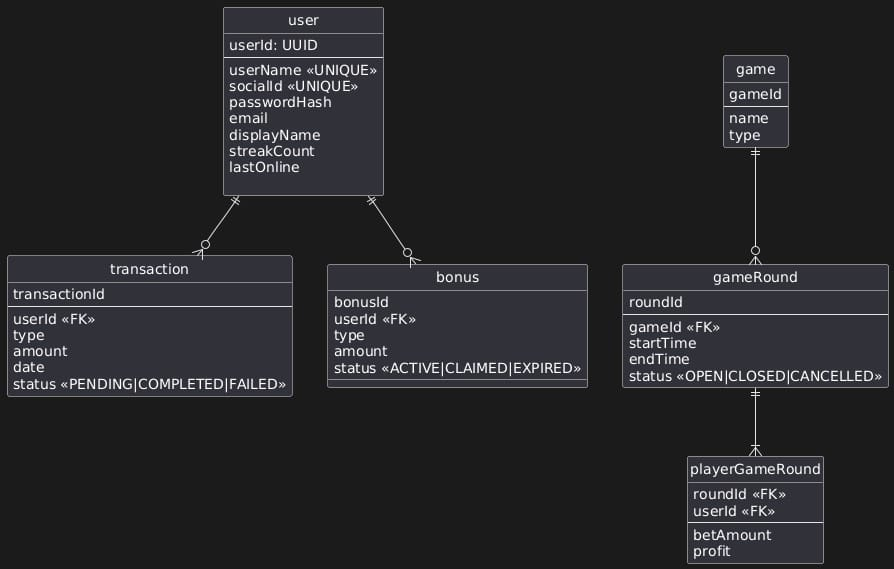

## 7. Chancen und Risiken

- **Strengths (Stärken)**
  - Hohe Motivation im Team
  - Klare Rollen-Verteilung
- **Weaknesses (Schwächen)**
  - Zeitdruck
  - Erstes großes Projekt -> unerfahren
- **Opportunities (Chancen)**
  - Sammeln von Erfahrungen
  - Eventuell Geld verdienen
- **Threats (Risiken)**
  - Mergekonflikte / Git-Chaos
  - Unübersichtlicher Code

## 8. Projektplanung

### 8.1. Feature-Priorisierung

1. Entwicklung der Benutzeroberfläche
2. Integration der Casinospiele
3. Währungssystem
4. Benutzeraccount-System
5. Testen

### 8.2. Meilensteine

1. **Ostern:** Funktionierender Grundsatz (erste Spiele spielbar und grobe Benutzeroberfläche)
2. **Mai:** Weitere Funktionen und Features + anschauliches UI/UX
3. **Juni:** Polishing und Fertigstellung, eventuelle Monetarisierung
