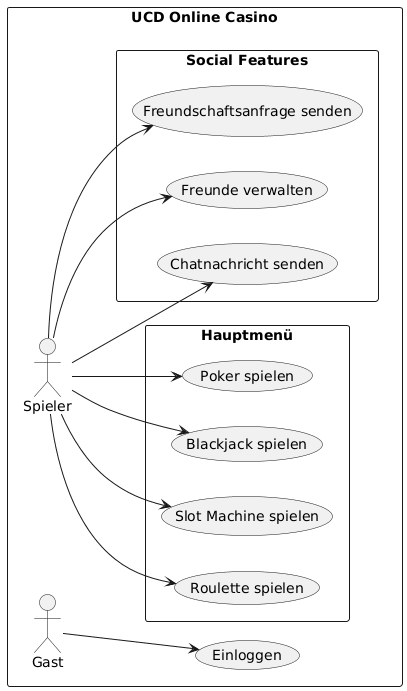
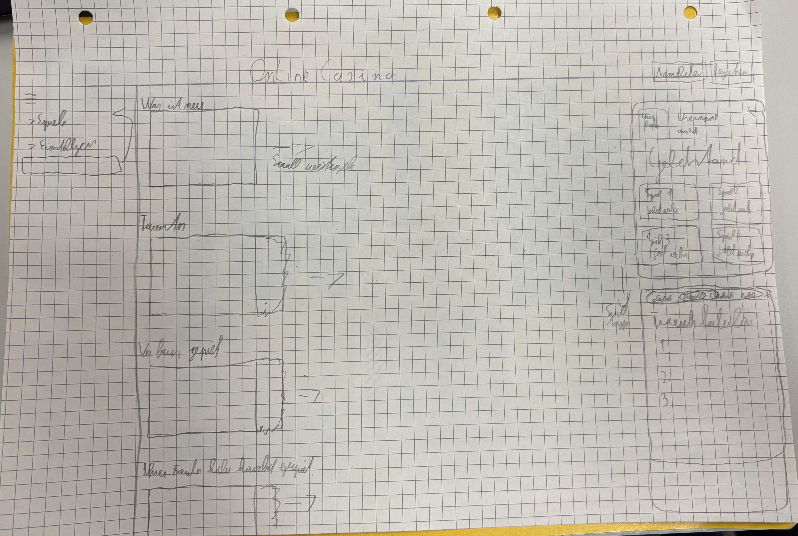
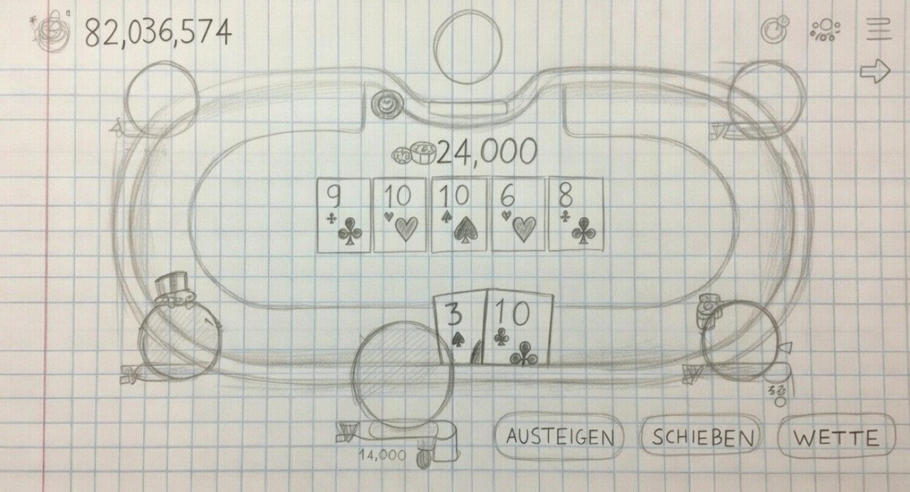

# Pflichtenheft - Online Casino

## Inhaltsverzeichnis

- [1. Ausgangslage](#1-ausgangslage)
  - [1.1. Ist-Situation](#11-ist-situation)
  - [1.2. Verbesserungspotenziale](#12-verbesserungspotenziale)
- [2. Zielsetzung](#2-zielsetzung)
- [3. Funktionale Anforderungen](#3-funktionale-anforderungen)
  - [3.1 Use Case A: Benutzerregistrierung und Login](#31-use-case-a-benutzerregistrierung-und-login)
  - [3.2 Use Case B: Haupmenü](#32-use-case-b-haupmenü)
  - [3.3 Use Case C: Spielen von Tischspielen (z.B. Poker, Roulette, Blackjack)](#33-use-case-c-spielen-von-tischspielen-zb-poker-roulette-blackjack)

## 1. Ausgangslage

### 1.1. Ist-Situation

- Siehe Projektantrag

### 1.2. Verbesserungspotenziale

- Siehe Projektantrag

## 2. Zielsetzung

- Siehe Projektantrag

## 3. Funktionale Anforderungen

Die Zielsetzung ist die Entwicklung eines benutzerfreundlichen Online-Casinos mit moderner Benutzeroberfläche. Es sollen verschiedene Spiele implementiert werden: Slots, Poker, Roulette und Blackjack. Das System soll eine Währung (virtuelles Geld) handhaben, Benutzerkonten verwalten und faire Zufallslogik sicherstellen.

Ziele umfassen: Hohe Verfügbarkeit, Automatisierung der Spiele, Sammeln von Projekterfahrungen und potenziell Monetarisierung. Die Umsetzung erfolgt in Meilensteinen: Grundfunktionen bis Ostern, Erweiterungen bis Mai, Fertigstellung bis Juni.

### 3.1 Use Case A: Benutzerregistrierung und Login
**Akteur:** Potenzieller Spieler
**Vorbedingung:** Der Benutzer öffnet die Website des Online-Casinos.
**Beschreibung:**
1. Der Benutzer navigiert zur Registrierungsseite.
2. Er gibt persönliche Daten ein (z.B. E-Mail, Passwort, Alter zur Altersverifikation).
3. Das System validiert die Daten und erstellt ein Konto.
4. Nach Registrierung loggt sich der Benutzer ein.
5. Das System authentifiziert den Benutzer und gewährt Zugriff auf das Dashboard.
**Nachbedingung:** Der Benutzer ist eingeloggt und kann Spiele spielen.
**Ausnahmen:** Ungültige Daten führen zu Fehlermeldungen.

Mockup der Login-Seite:

### 3.2 Use Case B: Haupmenü
**Akteur:** Eingeloggter Spieler

**Vorbedingung:** Der Benutzer ist eingeloggt und hat Guthaben auf dem Konto.

**Beschreibung:**
1. Der Benutzer öffnet die Anwendung nach dem Login
2. Das System zeigt das Hauptmenü (Dashboard) an
3. Der Benutzer sieht folgende zentrale Elemente:
    1. Aktuelles Guthaben & Bonusinformationen (oben prominent)
    2. Schnellzugriffe / Kategorien (Slots, Live Casino, Tischspiele, Sportwetten, Crash/Turbo-Spiele etc.)
    3. Empfohlene / beliebte Spiele (Carousel oder Grid)
    4. Kontostand und Chat
    
4. Der Benutzer kann per Klick/Tap in einen Spielbereich wechseln oder eine Aktion starten (z. B. Einzahlen, Spiel öffnen)

**Nachbedingung:** Das Spielergebnis ist verarbeitet, Guthaben aktualisiert.

**Ausnahmen:** Keine Internetverbindung → Offline-Hinweis, Session abgelaufen → Rückleitung zum Login

Mockup des Hauptmenüs

### 3.3 Use Case C: Spielen von Tischspielen (Poker)
**Akteur:** Eingeloggter Spieler

**Vorbedingung:** Der Benutzer hat Guthaben und wählt ein Tischspiel.

**Beschreibung:**
1. Der Benutzer betritt den virtuellen Pokertisch
2. Er platziert Einsätze.
3. Das System simuliert das Spiel (Karten austeilen, Rad drehen etc.) mit Zufallsalgorithmen.
4. Runden werden ausgewertet, Gewinne/Verluste berechnet.
5. Der Benutzer kann aus der Runde aussteigen er kann mitgehen und den Einsatzt erhöhen.

**Nachbedingung:** Spielstand aktualisiert, Guthaben angepasst.

**Ausnahmen:** Verbindungsprobleme führen zu Pausen, Unzureichendes Guthaben verhindert den Start.

Mockup
